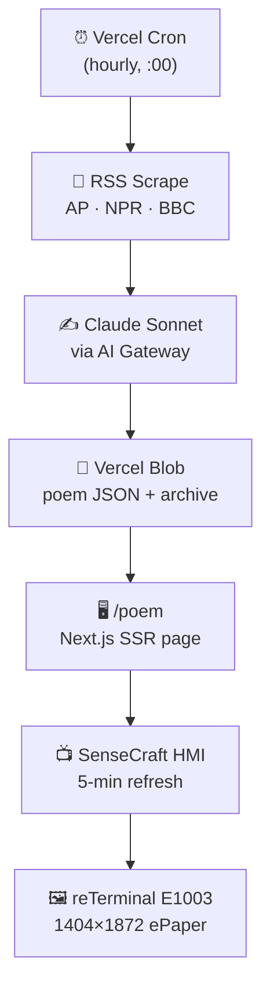

# Palimpsest — Architecture

## Pipeline



## Stack

| Layer | Technology | Notes |
|-------|-----------|-------|
| Hosting | Vercel (Next.js 16) | `frame-art-gold.vercel.app` |
| Scheduling | Vercel Cron | `0 * * * *` (hourly) |
| News | RSS feeds via fetch | AP, NPR, BBC — no API keys |
| AI | Claude Sonnet via Vercel AI Gateway | `AI_GATEWAY_API_KEY` in env |
| Storage | Vercel Blob | Poem JSON + archive |
| Rendering | Next.js SSR (`/poem`) | 1404×1872 HTML page |
| Delivery | SenseCraft HMI (HTML widget) | 5-min refresh interval |
| Display | reTerminal E1003 | 10.3" ePaper, 16-level grayscale |

## Repo

- **GitHub**: `nh-entryway/frame-art`
- **Device**: Ark Art Frame (device_id: 20226906)
- **SenseCraft API key**: stored in Vercel env as `SENSECRAFT_API_KEY`

## Endpoints

| Route | Purpose |
|-------|---------|
| `/poem` | SSR page rendered by SenseCraft → ePaper |
| `/api/generate` | Cron endpoint: scrape → poem → store |
| `/api/poem-data` | JSON API: latest poem data |
| `/` | Web gallery + archive |

## Data Flow

```
1. Cron fires at :00
2. /api/generate fetches RSS feeds, extracts ~10 headlines
3. Current poem in Blob becomes "ghost poem"
4. Claude generates new poem from headlines + time-of-day context
5. New poem data saved to Blob:
   {
     currentPoem, ghostPoem, fragments[],
     hour, date, generatedAt
   }
6. Within 5 minutes, SenseCraft re-renders /poem
7. /poem reads Blob, applies time-of-day typography, outputs HTML
8. ePaper displays the result
```

## Environment Variables

| Key | Where | Purpose |
|-----|-------|---------|
| `AI_GATEWAY_API_KEY` | Vercel | Anthropic via AI Gateway |
| `BLOB_READ_WRITE_TOKEN` | Vercel | Vercel Blob access |
| `CRON_SECRET` | Vercel | Protects /api/generate |
| `SENSECRAFT_API_KEY` | Vercel | SenseCraft push API (optional) |

## Dependencies

```json
{
  "@vercel/blob": "latest"
}
```

All other operations use native `fetch`.

## Validated ✅

- [x] SenseCraft HMI renders Vercel-hosted HTML on ePaper
- [x] 5-minute auto-refresh works
- [x] AI Gateway connected (Anthropic + OpenAI)
- [x] Vercel deployment pipeline (git push → auto-deploy)
- [x] Palimpsest visual concept renders correctly on display
